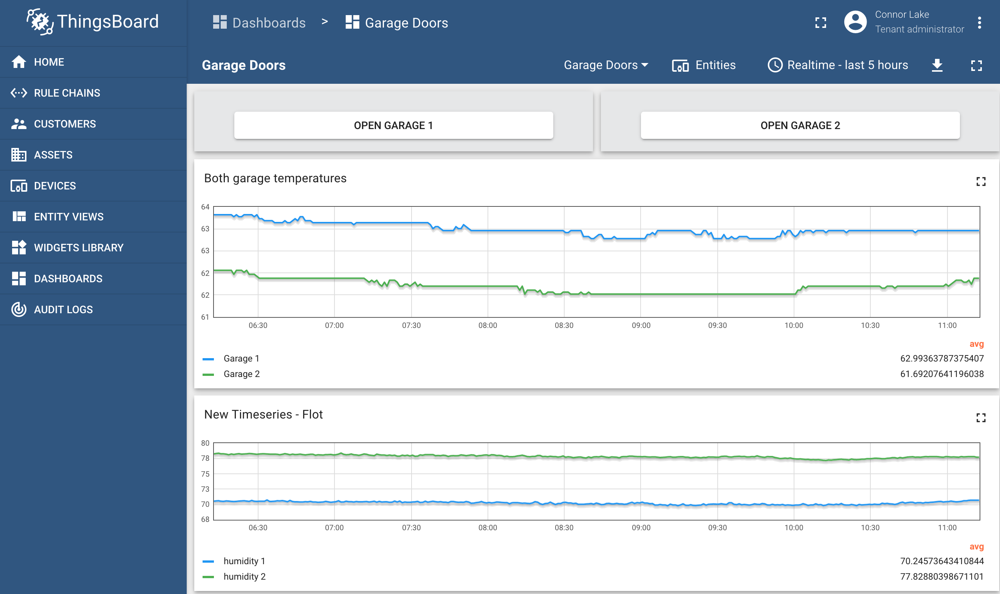
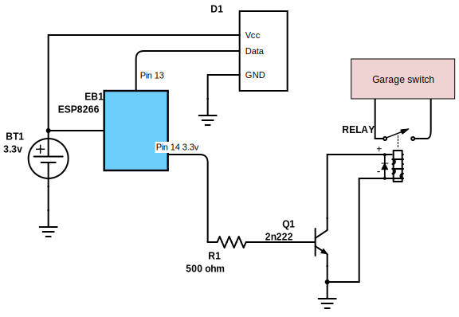
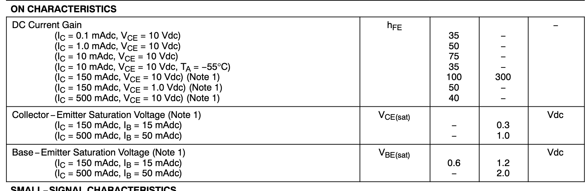

# Garage Control

I wrote code to make my garage doors wifi controlled.

It uses an esp8266 Node MCU chip to control a [relay] that pushes the garage door button for 700ms. It uses MQTT communicating to thingsboard as the controller.  I created a dashboard to control the garage doors.

The chips also have [DHT22](https://www.amazon.com/gp/product/B07XBVR532) temp and humidity monitor.

I used [this](https://github.com/thingsboard/ThingsBoard-Arduino-MQTT-SDK/blob/master/examples/0002-arduino_rpc/0002-arduino_rpc.ino) and [this](https://github.com/thingsboard/ThingsBoard-Arduino-MQTT-SDK/blob/master/examples/0003-esp8266_send_data/0003-esp8266_send_data.ino) for reference.

## Things learned

1. Relays must have a diode (usually [Schottky](https://www.amazon.com/gp/product/B07BTY8FD2)) in reverse flow of current to absorb the voltage spike caused by the inductor.
2. BJTs are intimidating but aren't soo bad.  See the below section.

## The BJT transistor

I used a [2n222 BJT transistor](https://www.onsemi.com/pub/Collateral/P2N2222A-D.PDF) to switch the relay on and off.

You can see the base-emitter saturation voltage is `.6-1.2` volts with `Ib=15mA` to get a collector current of `150mA`.  At 3.3v logic we meet that totally fine.

### Current

Generally to calculate the base resistor, you need to calculate your desired collector emitter voltage, and divide that by `Hfe`.

I think the [relay] has a current draw of about 80ma.  `Hfe` (current gain) at approximately our numbers would be about 50-100.  Let's assume 50.  That means we need to deliver .080/50=1.6ma. Apparently it's useful to multiply that number by 5 (something I didn't know).  That gives us 8ma.  To deliver that at 3.3v-.7 (.7 voltage drop over the transistor) would be V=IR, `2.6=(.008)R`.  `R=~325ohm`. At first I tried 1kohm and it didn't open the transistor enough.  Then I tried 500ohm and it worked.

[relay]:(https://www.amazon.com/gp/product/B0874LXW9Q)